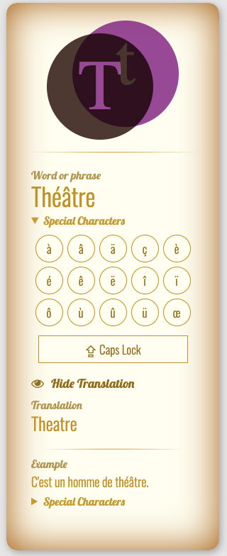

# Flashcards App v.2

## Setting up the environment (one time stuff)

1. Either download the zip file or clone the repository
2. `cd` into the newly created folder and run `yarn install` to install the build tools (gulp & gulp plugins)
3. Done!

## Every time you work on Flashcards app

Run `gulp` before making any changes, to automatically build every time you save.

## Building and deploying the app

Run `gulp build` and deploy the `dist` folder.

## License

The content of this repository is licensed under an [MIT License](https://opensource.org/licenses/MIT).
